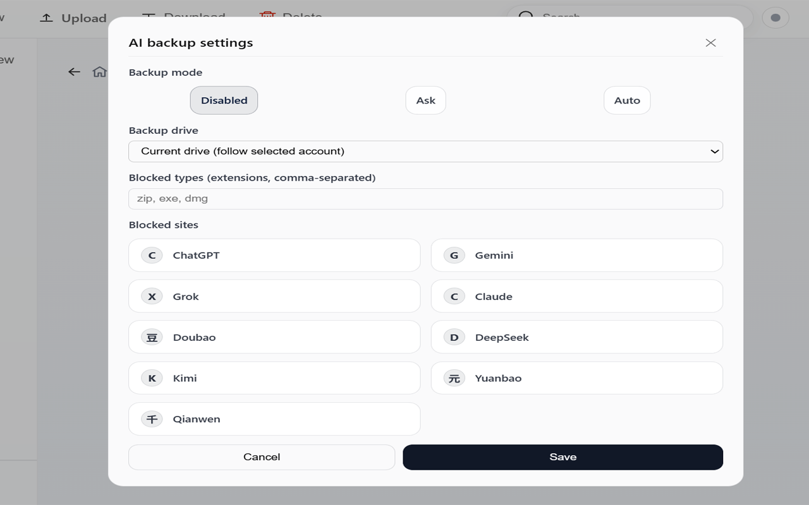
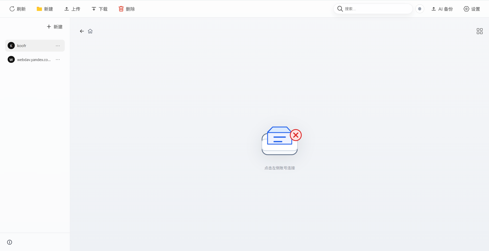
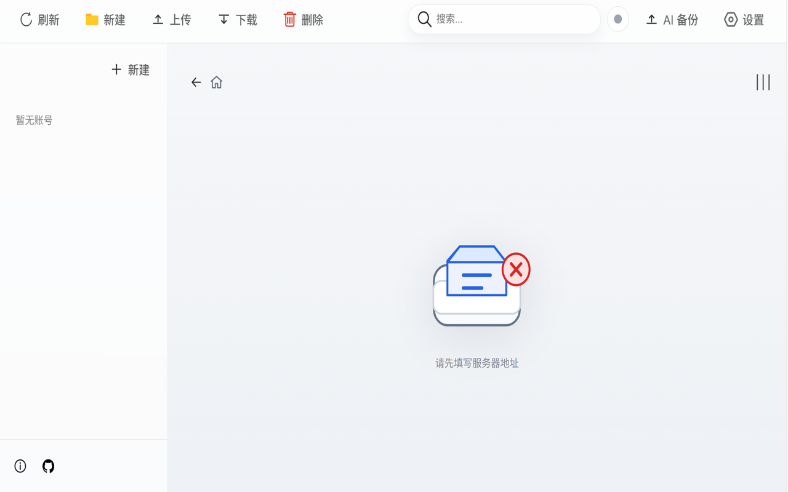

# WebDAV 云盘助手

<p align="center">
  <a href="#中文"><kbd>🇨🇳 中文</kbd></a>
  <a href="#english"><kbd>🇺🇸 English</kbd></a>
</p>

<p align="center">
  
</p>

<p align="center">
  🌟 WebDAV 文件管理器 ✨ 上传进度 🔄 同步缓存 🤖 AI 上传备份
</p>

一个浏览器扩展：把 WebDAV 当作你的网盘，并在常见 AI 网站上传文件时自动备份到 WebDAV。

## 🖼️ 插件效果展示

> 展示部分效果

<p align="center">
  
</p>
<p align="center">
  
</p>
<p align="center">
  
</p>

## 中文

### ✅ 功能特性

- 📁 WebDAV 文件管理：浏览、搜索、排序、创建文件夹、重命名、删除、下载
- ⏫ 上传增强：上传进度、上传详情（大小、已上传、网速）、可终止上传
- 👀 预览：图片、文本等常见格式预览（按文件类型自动判断）
- 🧠 缓存与同步：缓存下载内容、自动同步、手动同步（可配置并发与缓存上限）
- 🤖 AI 上传备份：在 ChatGPT、Gemini、Grok、Claude、豆包、元宝、千问 等网站选择上传文件时，可按规则自动备份到 WebDAV
- 🧩 规则控制：禁止备份、询问备份、自动备份；可按扩展名禁用；可按站点禁用

### 🧰 安装

1. 进入 `chrome://extensions`
2. 打开右上角“开发者模式”
3. 点击“加载已解压的扩展程序”，选择本项目根目录（包含 `manifest.json`）
4. 打开扩展页面，配置 WebDAV 账号信息并连接

### 🚀 使用

#### 📁 WebDAV 文件管理

- 在扩展页面中浏览目录、搜索文件、上传/下载/预览
- 上传时右上角会出现“上传”按钮，点击可查看详情并终止上传

#### 🤖 AI 文件自动备份

- 打开扩展页面 → 顶部导航栏“AI 备份” → 选择备份模式与规则
- 在受支持的 AI 网站中选择文件上传时，会触发备份逻辑：
  - 自动备份：直接备份到 WebDAV
  - 询问备份：页面内弹窗询问是否备份
  - 禁止备份：不做任何备份

备份目录结构示例（用层级表达，避免路径符号）：

```
AI Backups
  站点
    日期
      时间戳 加 原文件名
```

### 🔐 权限说明

- storage：保存账号与设置
- downloads：下载文件到本地
- tabs：按设置以 Tab 或 Popup 打开扩展页面
- alarms：定时自动同步
- host_permissions（http 与 https）：访问你的 WebDAV 服务
- content_scripts：在受支持 AI 网站监听页面文件选择事件，用于触发备份

### 🛡️ 隐私与安全

- WebDAV 账号信息保存在浏览器同步存储（`chrome.storage.sync`）中
- 备份仅在你启用 AI 备份功能后生效
- 不会上传除你选择的文件之外的任何页面内容

---

## English

### ✅ Features

- 📁 WebDAV file manager: browse, search, sort, mkdir, rename, delete, download
- ⏫ Upload UX: progress, detailed stats (total, uploaded, speed), abort
- 👀 Preview: common file previews (images, text)
- 🧠 Cache and sync: cache downloads, auto sync, manual sync, configurable limits
- 🤖 AI upload backup: automatically back up uploaded files from ChatGPT, Gemini, Grok, Claude, Doubao, Yuanbao, Qianwen to WebDAV
- 🧩 Rules: disable, ask, auto; block by extension; block by site

### 🧰 Installation

1. Open `chrome://extensions`
2. Enable “Developer mode”
3. Click “Load unpacked” and select the repository root (where `manifest.json` is)
4. Open the extension UI and configure your WebDAV account, then connect

### 🚀 Usage

#### 📁 WebDAV File Manager

- Use the extension page to browse, search, upload, download, preview files
- During upload, an “Upload” status button appears; click it for details and abort

#### 🤖 AI Upload Backup

- Open extension UI → “AI Backup” → choose mode and rules
- When you select a file on supported AI sites, backup runs based on your mode:
  - Auto: back up automatically
  - Ask: prompt on the page
  - Off: do nothing

Backup structure (hierarchy format):

```
AI Backups
  site
    date
      timestamp plus original filename
```

### 🔐 Permissions

- storage: store accounts and settings
- downloads: download files to your device
- tabs: open extension UI in a tab or popup
- alarms: scheduled auto-sync
- host_permissions (http and https): access your WebDAV endpoint
- content_scripts: detect file selection on supported AI sites to trigger backup

### 🛡️ Privacy and Security

- WebDAV credentials are stored in `chrome.storage.sync`
- AI backup only runs when enabled by you
- No page content is uploaded except the files you choose

